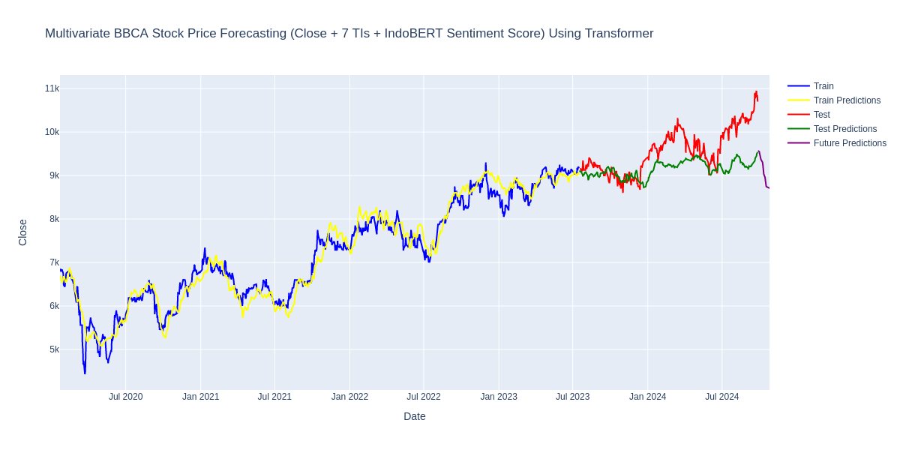
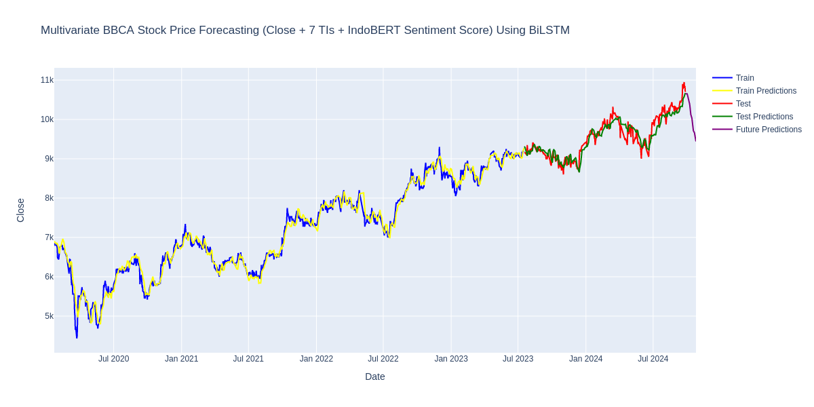
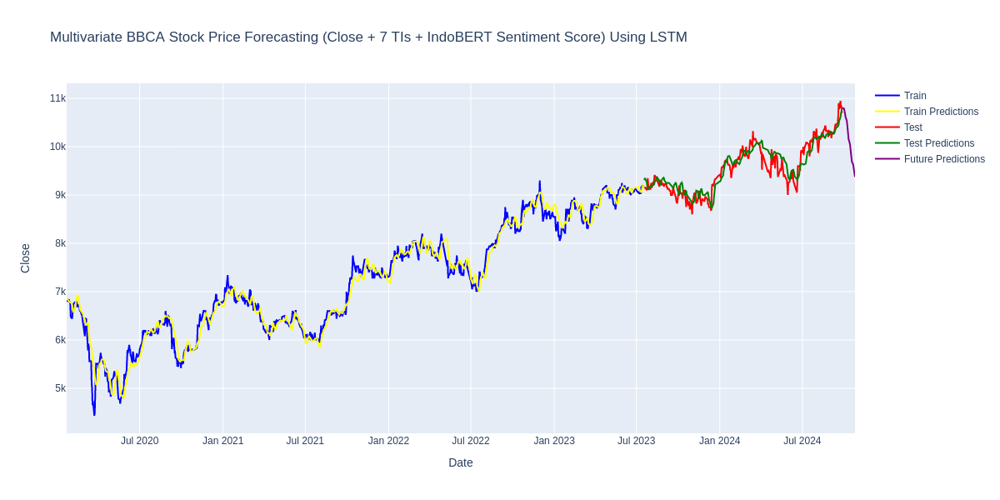
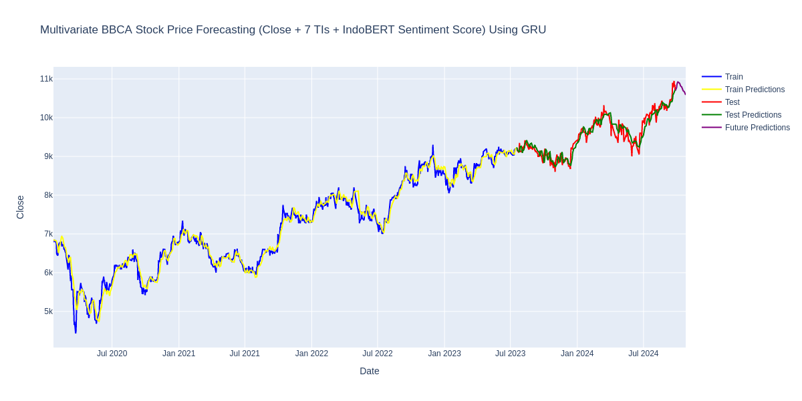

# Perbandingan Performa BiLSTM (MAE, MSE, RMSE, MAPE) 
**Running Trial:** 25  
**Code:** https://www.kaggle.com/code/rizr09/final-skripsi

## 7 TIs + IndoBERT W Transformer
### Trial 09 Summary

**Hyperparameters:**
- `num_transformer_blocks`: 4  
- `num_heads`: 5  
- `ff_dim`: 64  
- `dropout_rate`: 0.2  
- `num_dense_layers`: 1  
- `dense_units`: 192  
- `dense_dropout`: 0.2  

**Score:** 0.0006428841006709263  

---

### Model: "functional_4"

| Layer (type)                    | Output Shape          | Param #    |
|----------------------------------|-----------------------|------------|
| `input_layer (InputLayer)`      | (None, 14, 11)        | 0          |
| `transformer_block`             | (None, 14, 11)        | 4,123      |
| `transformer_block_1`           | (None, 14, 11)        | 4,123      |
| `transformer_block_2`           | (None, 14, 11)        | 4,123      |
| `transformer_block_3`           | (None, 14, 11)        | 4,123      |
| `global_average_pooling1d`      | (None, 11)            | 0          |
| `dense_8 (Dense)`               | (None, 192)           | 2,304      |
| `dropout_12 (Dropout)`          | (None, 192)           | 0          |
| `dense_9 (Dense)`               | (None, 1)             | 193        |

**Total params:** 18,989 (74.18 KB)  
**Trainable params:** 18,989 (74.18 KB)  
**Non-trainable params:** 0 (0.00 B)  

---

**Metrics:**
- **MSE:** 343749.3602  
- **MAE:** 452.8305  
- **RMSE:** 586.3014  
- **MAPE:** 4.5636%  

---

## <a href="../Models/Transformer/7tis_indobert_transformer.html">Interactive Plot</a>

---

## 7 TIs + IndoBERT W BiLSTM
### Trial 00 Summary

**Hyperparameters:**
- `units_1`: 128  
- `dropout_1`: 0.4  
- `units_2`: 96  
- `dropout_2`: 0.3  
- `units_3`: 256  

**Score:** 0.00025109827402047813  

---

### Model: "sequential"

| Layer (type)                    | Output Shape          | Param #    |
|----------------------------------|-----------------------|------------|
| `bidirectional (Bidirectional)`  | (None, 14, 256)       | 143,360    |
| `dropout (Dropout)`             | (None, 14, 256)       | 0          |
| `bidirectional_1 (Bidirectional)`| (None, 14, 192)       | 271,104    |
| `dropout_1 (Dropout)`           | (None, 14, 192)       | 0          |
| `bidirectional_2 (Bidirectional)`| (None, 512)           | 919,552    |
| `dense (Dense)`                 | (None, 1)             | 513        |

**Total params:** 1,334,529 (5.09 MB)  
**Trainable params:** 1,334,529 (5.09 MB)  
**Non-trainable params:** 0 (0.00 B)  

---

**Metrics:**
- **MSE:** 30043.6704  
- **MAE:** 138.5850  
- **RMSE:** 173.3311  
- **MAPE:** 1.4417%  

---

## <a href="../Models/BiLSTM/7tis_indobert_bilstm.html">Interactive Plot</a>

---

## 7 TIs + IndoBERT W LSTM
### Trial 08 Summary

**Hyperparameters:**
- `units_1`: 128  
- `dropout_1`: 0.35  
- `units_2`: 320  
- `dropout_2`: 0.3  
- `units_3`: 448  

**Score:** 0.00039979560824576765  

---

### Model: "sequential"

| Layer (type)                    | Output Shape          | Param #    |
|----------------------------------|-----------------------|------------|
| `lstm (LSTM)`                   | (None, 14, 128)       | 71,680     |
| `dropout (Dropout)`             | (None, 14, 128)       | 0          |
| `lstm_1 (LSTM)`                 | (None, 14, 320)       | 574,720    |
| `dropout_1 (Dropout)`           | (None, 14, 320)       | 0          |
| `lstm_2 (LSTM)`                 | (None, 448)           | 1,378,048  |
| `dense (Dense)`                 | (None, 1)             | 449        |

**Total params:** 2,024,897 (7.72 MB)  
**Trainable params:** 2,024,897 (7.72 MB)  
**Non-trainable params:** 0 (0.00 B)  

---

**Metrics:**
- **MSE:** 34293.0025  
- **MAE:** 147.4623  
- **RMSE:** 185.1837  
- **MAPE:** 1.5522%  

---

## <a href="../Models/LSTM/7tis_indobert_lstm.html">Interactive Plot</a>

---

## 7 TIs + IndoBERT W GRU
### Trial 20 Summary

**Hyperparameters:**
- `units_1`: 480  
- `dropout_1`: 0.4  
- `units_2`: 480  
- `dropout_2`: 0.15  
- `units_3`: 384  

**Score:** 0.00023399187193717808  

---

### Model: "sequential"

| Layer (type)                    | Output Shape          | Param #    |
|----------------------------------|-----------------------|------------|
| `gru (GRU)`                     | (None, 14, 480)       | 709,920    |
| `dropout (Dropout)`             | (None, 14, 480)       | 0          |
| `gru_1 (GRU)`                   | (None, 14, 480)       | 1,385,280  |
| `dropout_1 (Dropout)`           | (None, 14, 480)       | 0          |
| `gru_2 (GRU)`                   | (None, 384)           | 997,632    |
| `dense (Dense)`                 | (None, 1)             | 385        |

**Total params:** 3,093,217 (11.80 MB)  
**Trainable params:** 3,093,217 (11.80 MB)  
**Non-trainable params:** 0 (0.00 B)  

---

**Metrics:**
- **MSE:** 21817.4105  
- **MAE:** 114.4861  
- **RMSE:** 147.7072  
- **MAPE:** 1.1987%  

---

## <a href="../Models/GRU/7tis_indobert_gru.html">Interactive Plot</a>

---

## Univariate w GRU
### Trial 03 Summary

**Hyperparameters:**
- `units_1`: 512  
- `dropout_1`: 0.2  
- `units_2`: 288  
- `dropout_2`: 0.1  
- `units_3`: 256  

**Score:** 0.00022619890660280362  

---

### Model: "sequential"

| Layer (type)                    | Output Shape          | Param #    |
|----------------------------------|-----------------------|------------|
| `gru (GRU)`                     | (None, 14, 512)       | 791,040    |
| `dropout (Dropout)`             | (None, 14, 512)       | 0          |
| `gru_1 (GRU)`                   | (None, 14, 288)       | 692,928    |
| `dropout_1 (Dropout)`           | (None, 14, 288)       | 0          |
| `gru_2 (GRU)`                   | (None, 256)           | 419,328    |
| `dense (Dense)`                 | (None, 1)             | 257        |

**Total params:** 1,903,553 (7.26 MB)  
**Trainable params:** 1,903,553 (7.26 MB)  
**Non-trainable params:** 0 (0.00 B)  

---

**Metrics:**
- **MSE:** 15794.1707  
- **MAE:** 97.5444  
- **RMSE:** 125.6749  
- **MAPE:** 1.0246%  

---

## <a href="../Models/Univariate GRU/univariate_gru.html">Interactive Plot</a>

---